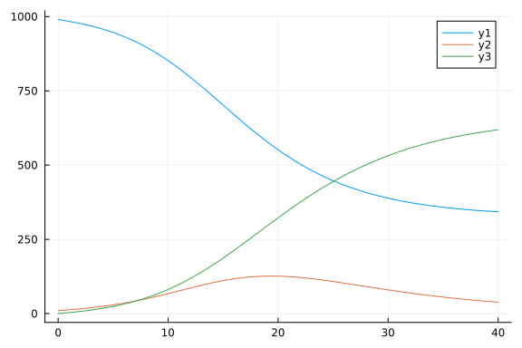

# Fractional differential equation model using FdeSolver.jl
Simon Frost (@sdwfrost), 2023-01-12

## Introduction

The classical ODE version of the SIR model is:

- Deterministic
- Continuous in time
- Continuous in state

ODEs can be generalized using [fractional calculus](https://en.wikipedia.org/wiki/Fractional_calculus) to become fractional differential equations (FDEs), which consider powers of the differential operator. Unlike ODEs, the solution of the FDE at a point `t` depends on the values of the solution on the whole intervall `[0,t]`, and in this way the system has 'memory'. The exponent of the fractional derivative can be used as an additional parameter when fitting the model to data. This tutorial shows how to solve an FDE using [FdeSolver.jl](hhttps://github.com/JuliaTurkuDataScience/FdeSolver.jl).

## Libraries

```julia
using FdeSolver
using Plots
using BenchmarkTools
```


## Transitions

Unlike the models in the SciML ecosystem, `FdeSolver.jl` expects the arguments of the model function to be (time, state, parameters), in addition to being out-of-place. The coefficients are raised to a power, α, which will also be the power to which the derivatives are raised. This ensures that the units of the left and right hand sides of the ODE are the same.

```julia
function sir_ode(t, u, p)
    (S, I, R) = u
    (β, γ, α) = p
    N = S+I+R
    dS = -(β^α)*I/N*S
    dI = (β^α)*I/N*S - (γ^α)*I
    dR = (γ^α)*I
    [dS, dI, dR]
end;
```


## Time domain

We set the timespan for simulations, `tspan`, initial conditions, `u0`, and parameter values, `p` (which are unpacked above as `[β, γ, α]`). We set the power of the fractional derivatives, α, and pass it as a parameter to the model in order to make the units consistent. Unlike the SciML models, `tspan` is a `Vector` rather than a `Tuple`.

```julia
tspan = [0.0, 40.0];
u0 = [990.0, 10.0, 0.0];
α = 0.9
p = [0.5, 0.25, α];
```


## Running the model

Running the model requires the model function, the time span, the initial state, a vector of exponents for the derivatives (in this example, all set to α), the parameter vector and the timestep `h`. This function returns a vector for the times at which the model is solved and a matrix of the state vector.

```julia
t, sol_fode = FDEsolver(sir_ode, tspan, u0, [α, α, α], p, h = 0.1);
```


## Plotting

```julia
plot(t, sol_fode)
```




## Changing the fractional derivatives

The effect of changing the power α can be seen below.

```julia
α₂ = 0.9
p₂ = [0.5, 0.25, α₂];
t₂, sol_fode₂ = FDEsolver(sir_ode, tspan, u0, [α₂, α₂, α₂], p₂, h = 0.1);
plot(sol_fode₂)
```


## References

- Christopher N. Angstmann, Austen M. Erickson, Bruce I. Henry, Anna V. McGann, John M. Murray, and James A. Nichols. (2021) A general famework for fractional order compartment models. SIAM Review 63(2):375–392. [https://doi.org/10.1137/21M1398549](https://doi.org/10.1137/21M1398549)
- Yuli Chen, Fawang Liu, Qiang Yu, and Tianzeng Li. (2021) Review of fractional epidemic models. Applied Mathematical Modeling, 97:281-307. [https://doi.org/10.1016/j.apm.2021.03.044](https://doi.org/10.1016/j.apm.2021.03.044)
- N. Zeraick Monteiros and Rodrigues Mazorche. (2021) Fractional derivatives applied to epidemiology. Trends in Computational and Applied Mathematics, 22(2):157-177. [https://doi.org/10.5540/tcam.2021.022.02.00157](https://doi.org/10.5540/tcam.2021.022.02.00157)

## Benchmarking

```julia
@benchmark FDEsolver(sir_ode, tspan, u0, [α, α, α], p, h = 0.1)
```

```
BenchmarkTools.Trial: 794 samples with 1 evaluation.
 Range (min … max):  5.196 ms … 34.878 ms  ┊ GC (min … max): 0.00% … 49.29%
 Time  (median):     5.579 ms              ┊ GC (median):    0.00%
 Time  (mean ± σ):   6.294 ms ±  4.260 ms  ┊ GC (mean ± σ):  6.12% ±  7.40%

  █▆                                                          
  ██▄▁▁▁▁▁▁▁▁▁▁▁▁▁▁▁▁▁▁▁▁▁▁▁▁▁▁▁▁▁▁▁▁▁▁▁▁▁▁▁▁▁▁▁▁▁▁▁▁▁▁▁▁▁▄▇ ▇
  5.2 ms       Histogram: log(frequency) by time     34.3 ms <

 Memory estimate: 5.69 MiB, allocs estimate: 52878.
```


