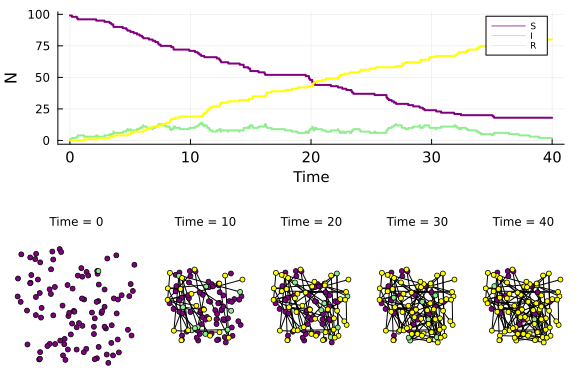
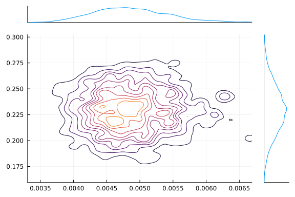
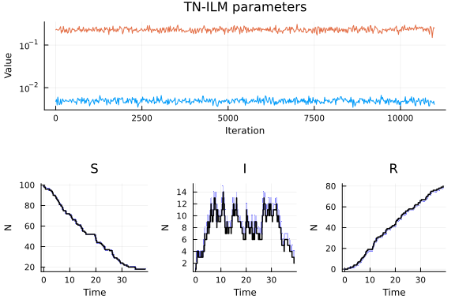
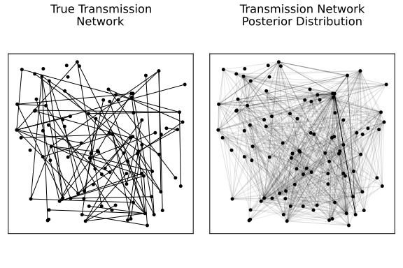

# Inference of transmission network individual-level model (TN-ILM) parameters using Pathogen.jl
Simon Frost (@sdwfrost), 2023-02-01

## Introduction

[Pathogen.jl](https://github.com/jangevaare/Pathogen.jl), described in [this paper](https://doi.org/10.18637/jss.v104.i04), is a package to simulate transmission network individual-level models, in which individuals can have their own risk factors that affect their contact with others, their susceptibility, their infectivity on infection, their recovery rates, etc.. It includes methods for stochastic simulation and Bayesian inference of SEIR, SEI, SIR, and SI individual level models. This tutorial is based on that included in the Pathogen.jl package, available [here](https://github.com/jangevaare/Pathogen.jl/blob/master/examples/SIR%20Simulation/SIR%20TN-ILM%20Simulation%20and%20Inference.ipynb), but simplified to match the parameter values used in this repository as closely as possible, in order to generate comparable results. This tutorial focuses on inference; for computational purposes, we consider a smaller population (`N=100`) than in most of the other examples; this also makes visualization of the transmission network clearer. The random number seed was chosen so as to ensure than an epidemic did not fade out immediately due to the small number (1) of initial infected individuals.

## Libraries

```julia
using Random
using Distributions
using Pathogen
using Plots
using Plots.PlotMeasures
using StatsPlots;
```


We set the random number seed for reproducibility.

```julia
Random.seed!(1);
```


## Setting up and running the model

The setting up and running of the model is described in more detail in the [simulation example](https://github.com/epirecipes/sir-julia/blob/master/markdown/sim_pathogen/sim_pathogen.md).

```julia
N = 100
I₀ = 1
locations = DataFrame(x = rand(Uniform(0, 10), N),
                  y = rand(Uniform(0, 10), N))

# Precalculate distances
dists = [1.0 for i = 1:N, j = 1:N]
# Set diagonal to zero
[dists[i,i] = 0.0 for i in 1:N]

pop = Population(locations, dists)

function _constant(params::Vector{Float64}, pop::Population, i::Int64)
    return params[1]
end

function _one(params::Vector{Float64}, pop::Population, i::Int64)
    return 1.0
end

function _zero(params::Vector{Float64}, pop::Population, i::Int64)
    return 0.0
end

function _one(params::Vector{Float64}, pop::Population, i::Int64, k:: Int64)
    return 1.0
end

rf = RiskFunctions{SIR}(_zero, # sparks function
                        _one, # susceptibility function
                        _one, # infectivity function: defines a distance
                        _constant, # transmissability function
                        _constant) # removal function

# Parametrize risk functions for simulation
rparams = RiskParameters{SIR}(Float64[], # sparks function parameter(s)
                              Float64[], # susceptibility function parameter(s)
                              Float64[], # infectivity function parameter(s)
                              [0.5/N], # transmissibility function parameter(s) βc/N
                              [0.25]) # removal function parameter(s) γ

# Set starting states in population
# Set first I₀ individuals as infectious, others as susceptible to start
starting_states = [fill(State_I, I₀); fill(State_S, N-I₀)]
# Initialize simulation
sim = Simulation(pop, starting_states, rf, rparams)
# Simulate
simulate!(sim, tmax=40.0);
```


## Plotting

```julia
p1 = plot(sim.events, 0.0, 40.0, legendfont=font(6), xaxis=font(10), bottom_margin=30px)
# Population/TransmissionNetwork plots
p2=plot(sim.transmission_network, sim.population, sim.events, 0.0, title="Time = 0", titlefontsize = 8)
p3=plot(sim.transmission_network, sim.population, sim.events, 10.0, title="Time = 10", titlefontsize = 8)
p4=plot(sim.transmission_network, sim.population, sim.events, 20.0, title="Time = 20", titlefontsize = 8)
p5=plot(sim.transmission_network, sim.population, sim.events, 30.0, title="Time = 30", titlefontsize = 8)
p6=plot(sim.transmission_network, sim.population, sim.events, 40.0, title="Time = 40", titlefontsize = 8)
# Combine
l = @layout [a
             grid(1,5)]
combinedplots1 = plot(p1, p2, p3, p4, p5, p6, layout=l)
```




## Inference

We first generate exact observations for infection and removal; the `observe` function from Pathogen.jl expects a `UnivariateDistribution` from Distributions.jl.

```julia
obs = observe(sim, Dirac(0.0), Dirac(0.0), force=true);
```


Next, we specify some priors for the risk parameters of our various risk functions, using `UnivariateDistribution[]` for fixed parameters.

```julia
rpriors = RiskPriors{SIR}(UnivariateDistribution[],
                          UnivariateDistribution[],
                          UnivariateDistribution[],
                          [Uniform(0.001, 0.01)],
                          [Uniform(0.1, 0.5)]);
```


We then  set some extents for event data augmentation

```julia
ee = EventExtents{SIR}(0.001, 0.001);
```


The Markov Chain Monte Carlo (MCMC) is initialized as follows. Multiple attempts are needed to get initial parameter values; larger numbers of attempts are needed for larger populations.

```julia
mcmc = MCMC(obs, ee, pop, starting_states, rf, rpriors)
start!(mcmc, attempts=10000); # 1 chain, with 10k initialization attempts
```


Assuming that the above has successfully initialized the Markov chain, the MCMC can be run as follows. Here, we use 11000 iterations, including a 1000 sample burn-in period, which should take a few minutes to run.

```julia
niter = 11000
burnin = 1000
thin = 20
iterate!(mcmc, niter, 1.0, condition_on_network=true, event_batches=5);
```


The `summary` function provides a table of the estimated parameters (the first is transmissibility, the second is recovery/removal).

```julia
summary(mcmc, burnin=burnin, thin=thin)
```

```
2×4 DataFrame
 Row │ parameter  mean       var          CI
     │ String     Float64    Float64      Tuple…
─────┼─────────────────────────────────────────────────────────────
   1 │ Ωt₁        0.0048973  3.10216e-7   (0.00392078, 0.00612848)
   2 │ Ωr₁        0.229968   0.000595299  (0.18608, 0.279817)
```


These parameter values can be extracted and visualized as follows.

```julia
β = [mcmc.markov_chains[1].risk_parameters[i].transmissibility[1] for i in (burnin+1):niter]
γ = [mcmc.markov_chains[1].risk_parameters[i].removal[1] for i in (burnin+1):niter];
```


```julia
marginalkde(β, γ)
```




Note that the removal rate estimates are centered close to the true value, while the inferred transmissibility parameter is an underestimate of the true value (although this is only for a single realization).

Here are the MCMC posterior plots, which show good mixing of the Markov chains.

```julia
# MCMC trace plot
p1 = plot(1:thin:niter,
  mcmc.markov_chains[1].risk_parameters, yscale=:log10, title="TN-ILM parameters", xguidefontsize=8, yguidefontsize=8, xtickfontsize=7, ytickfontsize=7, titlefontsize=11, bottom_margin=30px)

# State plots
p2 = plot(mcmc.markov_chains[1].events[niter], State_S,
          linealpha=0.01, title="S", xguidefontsize=8, yguidefontsize=8,
          xtickfontsize=7, ytickfontsize=7, titlefontsize=11)
for i=(burnin+1):thin:niter
  plot!(p2, mcmc.markov_chains[1].events[i], State_S, linealpha=0.01)
end
plot!(p2, sim.events, State_S, linecolor=:black, linewidth=1.5)

p3 = plot(mcmc.markov_chains[1].events[niter], State_I,
          linealpha=0.01, title="I", xguidefontsize=8, yguidefontsize=8, xtickfontsize=7, ytickfontsize=7, titlefontsize=11)
for i=(burnin+1):thin:niter
  plot!(p3, mcmc.markov_chains[1].events[i], State_I, linealpha=0.01)
end
plot!(p3, sim.events, State_I, linecolor=:black, linewidth=1.5)

p4 = plot(mcmc.markov_chains[1].events[niter], State_R,
          linealpha=0.01, title="R", xguidefontsize=8, yguidefontsize=8, xtickfontsize=7, ytickfontsize=7, titlefontsize=11)
for i=(burnin+1):thin:niter
  plot!(p4, mcmc.markov_chains[1].events[i], State_R, linealpha=0.01)
end
plot!(p4, sim.events, State_R, linecolor=:black, linewidth=1.5)
# Combine
l = @layout [a; [b c d]]
combinedplots2 = plot(p1, p2, p3, p4, layout=l)
```




Finally, we can plot out the inferred transmission network compared to the true network.

```julia
p1 = plot(sim.transmission_network, sim.population, title="True Transmission\nNetwork", titlefontsize=11, framestyle=:box)

tnp = TransmissionNetworkPosterior(mcmc, burnin=burnin, thin=thin)
p2 = plot(tnp, sim.population, title="Transmission Network\nPosterior Distribution", titlefontsize=11, framestyle=:box)

combinedplots3 = plot(p1, p2, layout=(1, 2))
```


