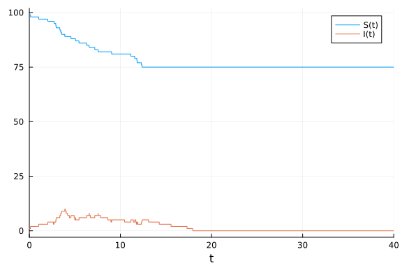
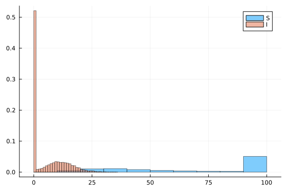
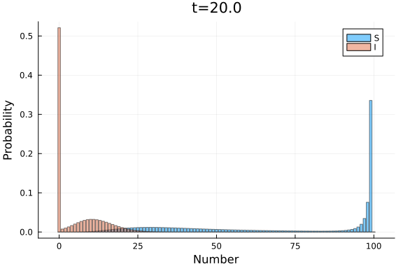
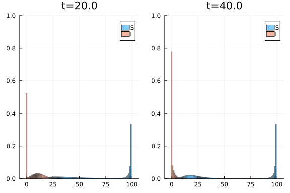

# Finite state projection of a stochastic SIR model
Simon Frost (@sdwfrost) 2023-02-15

## Introduction

The [finite state projection](https://doi.org/10.1063/1.2145882) method is an approach which takes a stochastic model, and converts it to a set of linear ordinary differential equations known as the chemical master equation (CME), where the ODEs describe the probability of observing a specific site at a given time. Here, we use FiniteStateProjection.jl to turn a reaction network/system into the chemical master equation.

## Libraries

```julia
using Catalyst
using ModelingToolkit
using FiniteStateProjection
using OrdinaryDiffEq
using JumpProcesses
using Random
using Plots
using StatsPlots
```


## Transitions

FiniteStateProjection.jl accepts either a reaction network created with the `@reaction_network` macro, or a `ReactionSystem` created from a vector of `Reaction`s. The following definitions for `rn` and `rs` are equivalent, although we will use the `ReactionSystem` as it allows a wider range of models to be simulated (such as having state variables in the rates).

```julia
rn = @reaction_network SIR begin
    β, S + I --> 2I
    γ, I --> 0
end β γ
```

```
Model SIR
States (2):
  S(t)
  I(t)
Parameters (2):
  β
  γ
```


```julia
@parameters t β γ
@variables S(t) I(t)
rxs = [Reaction(β, [S,I], [I], [1,1], [2])
       Reaction(γ, [I], [])]
@named rs  = ReactionSystem(rxs, t, [S,I], [β,γ])
```

```
Model rs
States (2):
  S(t)
  I(t)
Parameters (2):
  β
  γ
```


## Initial conditions, parameter values, and timespan for the ODE

We can turn the above systems into a system of ordinary differential equations, stochastic differential equations, or a jump process, as described in the [reaction network](https://github.com/epirecipes/sir-julia/tree/master/markdown/rn_mtk) example.

```julia
p = [0.005, 0.25]
u0 = [99, 1]
δt = 1.0
tspan = (0.0, 40.0)
solver = Tsit5()
```

```
Tsit5(stage_limiter! = trivial_limiter!, step_limiter! = trivial_limiter!, 
thread = static(false))
```


Here is the solution of the `ReactionSystem`, when converted into a set of ODEs.

```julia
prob_ode = ODEProblem(rs, u0, tspan, p)
sol_ode = solve(prob_ode, solver)
plot(sol_ode)
```


Similarly, the `ReactionSystem` can be turned into a jump process.

```julia
Random.seed!(1)
jumpsys = convert(JumpSystem, rs)
dprob = DiscreteProblem(jumpsys, u0, tspan, p)
jprob = JumpProblem(jumpsys, dprob, Direct())
jsol = solve(jprob, SSAStepper())
plot(jsol)
```




Multiple runs of the jump process can be used to calculate the distribution of states at a given time.

```julia
ensemble_jprob = EnsembleProblem(jprob)
ensemble_jsol = solve(ensemble_jprob,SSAStepper(),trajectories=10000);
```


This shows the distribution of susceptibles and infected at time `t=20`.

```julia
jstates = [s(20) for s in ensemble_jsol]
histogram([s[1] for s in jstates], label="S", normalize=:pdf, alpha=0.5)
histogram!([s[2] for s in jstates], label="I", normalize=:pdf, alpha=0.5)
```




## Finite state projection

Rather than simulate a large number of trajectories to find the probability of observing a specific state at a given time, we can convert the reaction network/system to a set of ODEs. The initial conditions are the probability of observing a specific state `S=s, I=i` at time `t=0`.

```julia
sys_fsp = FSPSystem(rn) # or FSPSystem(rs)
u0f = zeros(101, 101) # 2D system as we have two states
u0f[100,2] = 1.0 # this is equivalent to setting S(0)=99 and I(0)=1
prob_fsp = convert(ODEProblem, sys_fsp, u0f, tspan, p)
sol_fsp = solve(prob_fsp, solver, dense=false, saveat=δt);
```


## Plotting

```julia
bar(0:1:100,
    sum(sol_fsp.u[21],dims=2),
    xlabel="Number",
    ylabel="Probability",
    label="S",
    title="t="*string(sol_fsp.t[21]),
    alpha=0.5)
bar!(0:1:100,
     sum(sol_fsp.u[21],dims=1)',
     label="I",
     alpha=0.5)
```



```julia
p1 = bar(0:1:100, sum(sol_fsp.u[21],dims=2), label="S", title="t="*string(sol_fsp.t[21]), ylims=(0,1), alpha=0.5)
bar!(p1, 0:1:100, sum(sol_fsp.u[21],dims=1)', label="I",alpha=0.5)
p2 = bar(0:1:100, sum(sol_fsp.u[41],dims=2), label="S", title="t="*string(sol_fsp.t[41]), ylims=(0,1), alpha=0.5)
bar!(p2, 0:1:100, sum(sol_fsp.u[41],dims=1)', label="I", alpha=0.5)
l = @layout [a b]
plot(p1, p2, layout=l)
```


