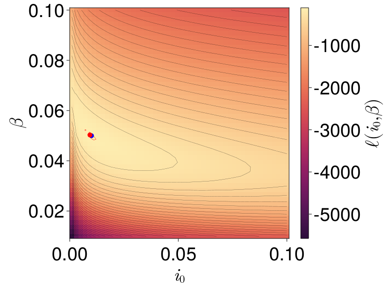
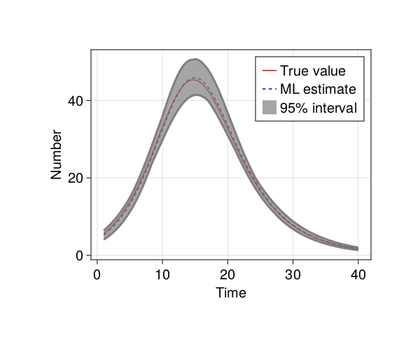

# Ordinary differential equation model with full likelihood intervals using ProfileLikelihood.jl
Simon Frost (@sdwfrost), 2022-12-22

## Introduction

The classical ODE version of the SIR model is:

- Deterministic
- Continuous in time
- Continuous in state

In this notebook, we try to infer the parameter values from a simulated dataset using a full likelihood approach to capture uncertainty, using tools from the [ProfileLikelihood.jl](https://github.com/ph-kev/ProfileLikelihood.jl) package.

## Libraries

```julia
using OrdinaryDiffEq
using ProfileLikelihood
using StatsFuns
using Random
using Distributions
using Optimization
using OptimizationOptimJL
using QuasiMonteCarlo
using CairoMakie
using LaTeXStrings
using DataFrames
```


## Transitions

The following function provides the derivatives of the model, which it changes in-place. A variable is included for the cumulative number of infections, $C$.

```julia
function sir_ode!(du, u, p, t)
    (S, I, R, C) = u
    (β, c, γ) = p
    N = S+I+R
    infection = β*c*I/N*S
    recovery = γ*I
    @inbounds begin
        du[1] = -infection
        du[2] = infection - recovery
        du[3] = recovery
        du[4] = infection
    end
    nothing
end;
```


## Time domain

We set the timespan for simulations, `tspan`, initial conditions, `u0`, and parameter values, `p` (which are unpacked above as `[β, c, γ]`).

```julia
δt = 1.0
tmax = 40.0
tspan = (0.0,tmax);
```


## Initial conditions

```julia
u₀ = [990.0, 10.0, 0.0, 0.0]; # S, I, R, C
```


## Parameter values

```julia
p = [0.05, 10.0, 0.25]; # β, c, γ
```


## Running the model

```julia
prob_ode = ODEProblem(sir_ode!, u₀, tspan, p)
sol_ode = solve(prob_ode, Tsit5(), saveat=δt);
```


We convert the output to an `Array` for further processing.

```julia
out = Array(sol_ode);
```


## Plotting the solution

The following code demonstrates how to plot the time series using [Makie.jl](https://github.com/MakieOrg/Makie.jl).

```julia
colors = [:blue, :red, :green, :purple]
legends = ["S", "I", "R", "C"]
fig = Figure()
ax = Axis(fig[1, 1])
for i = 1:4
    lines!(ax, sol_ode.t, out[i,:], label = legends[i], color = colors[i])
end
axislegend(ax)
ax.xlabel = "Time"
ax.ylabel = "Number"
fig
```


## Generating data

The cumulative counts are extracted.

```julia
C = out[4,:];
```


The new cases per day are calculated from the cumulative counts.

```julia
X = C[2:end] .- C[1:(end-1)];
```


Although the ODE system is deterministic, we can add measurement error to the counts of new cases. Here, a Poisson distribution is used, although a negative binomial could also be used (which would introduce an additional parameter for the variance).

```julia
Random.seed!(1234);
```


```julia
data = rand.(Poisson.(X));
```


## Optimization

`ProfileLikelihood.jl` expects a log-likelihood function with the parameter vector, `θ`, the data, and the integrator used for the model - see the documentation on [the integrator interface of `DifferentialEquations.jl`](https://docs.sciml.ai/DiffEqDocs/stable/basics/integrator/) for more details.

```julia
function ll(θ, data, integrator)
    (i0,β) = θ
    integrator.p[1] = β
    integrator.p[2] = 10.0
    integrator.p[3] = 0.25
    I = i0*1000.0
    u₀=[1000.0-I,I,0.0,0.0]
    reinit!(integrator, u₀)
    solve!(integrator)
    sol = integrator.sol
    out = Array(sol)
    C = out[4,:]
    X = C[2:end] .- C[1:(end-1)]
    nonpos = sum(X .<= 0)
    if nonpos > 0
        return Inf
    end
    sum(logpdf.(Poisson.(X),data))
end;
```


We specify the lower and upper bounds of the parameter values, `lb` and `ub` respectively, and the initial parameter values, `θ₀`.

```julia
lb = [0.001, 0.01] # Lower bound
ub = [0.1, 0.1] # Upper bound
θ = [0.01, 0.05] # Exact values
θ₀ = [0.002, 0.08]; # Initial conditions for optimization
```


The following shows how to obtain a single log-likelihood value for a set of parameter values using the integrator interface.

```julia
integrator = init(prob_ode, Tsit5(); saveat = δt) # takes the same arguments as `solve`
ll(θ₀, data, integrator)
```

```
-561.9030701968085
```


We use the log-likelihood function, `ll`, to define a `LikelihoodProblem`, along with initial parameter values, `θ₀`, the function describing the model, `sir_ode!`, the initial conditions, `u₀`, and the maximum time.

```julia
syms = [:i₀, :β]
prob = LikelihoodProblem(
    ll, θ₀, sir_ode!, u₀, tmax; 
    syms=syms,
    data=data,
    ode_parameters=p, # temp values for p
    ode_kwargs=(verbose=false, saveat=δt),
    f_kwargs=(adtype=Optimization.AutoFiniteDiff(),),
    prob_kwargs=(lb=lb, ub=ub),
    ode_alg=Tsit5()
);
```


## Grid search to identify the maximum likelihood value and the likelihood region

We first set the critical value of the likelihood in order to calculate the intervals.

```julia
crit_val = 0.5*quantile(Chisq(2),0.95)
```

```
2.99573227355399
```


### Regular grid

We first use a coarse regular grid (with 10 points along each of the axes) to refine the bounds of the parameters.

```julia
n_regular_grid = 50
regular_grid = RegularGrid(lb, ub, n_regular_grid);
```


```julia
gs, loglik_vals = grid_search(prob, regular_grid; save_vals=Val(true), parallel = Val(true))
gs
```

```
LikelihoodSolution. retcode: Success
Maximum likelihood: -108.10376989661182
Maximum likelihood estimates: 2-element Vector{Float64}
     i₀: 0.009081632653061226
     β: 0.05040816326530613
```


This is going to give us a crude maximum likelihood estimate and region, but this can still be used to discard unlikely parameter values and keep ones that are more consistent with the data ('Not Ruled Out Yet' or NROY). Note that only a small number of samples are NROY.

```julia
gs_max_lik, gs_max_idx = findmax(loglik_vals)
nroy = loglik_vals .>= (gs_max_lik - crit_val)
nroyp = [ProfileLikelihood.get_parameters(regular_grid,(i,j)) for i in 1:n_regular_grid for j in 1:n_regular_grid if nroy[i,j]==1]
```

```
3-element Vector{Vector{Float64}}:
 [0.007061224489795919, 0.052244897959183675]
 [0.009081632653061226, 0.05040816326530613]
 [0.011102040816326531, 0.04857142857142858]
```


### Latin hypercube sampling

We now refine the parameter bounds from our coarse grid search, and run the model using a Latin hypercube sample over a fine (irregular) grid.

```julia
lb2 = [minimum([x for x in nroyp[i]]) for i in 1:2] .* 0.5
ub2 = [maximum([x for x in nroyp[i]]) for i in 1:2] .* 2;
```


```julia
n_lhs = 10000
parameter_vals = QuasiMonteCarlo.sample(n_lhs, lb2, ub2, LatinHypercubeSample());
```


```julia
irregular_grid = IrregularGrid(lb, ub, parameter_vals);
```


```julia
gs_ir, loglik_vals_ir = grid_search(prob, irregular_grid; save_vals=Val(true), parallel = Val(true))
gs_ir
```

```
LikelihoodSolution. retcode: Success
Maximum likelihood: -108.62751418446815
Maximum likelihood estimates: 2-element Vector{Float64}
     i₀: 0.008346365306122448
     β: 0.050695295918367356
```


## ML

We can obtain a more precise maximum likelhood estimate of the parameters using one of the algorithms in `Optimization.jl`. Here, we use `NelderMead` from `Optim.jl`, imported with `using OptimizationOptimJL` at the beginning of the notebook, using an updated initial estimate from our grid search.

```julia
prob = update_initial_estimate(prob, gs_ir)
sol = mle(prob, Optim.LBFGS())
θ̂ = get_mle(sol);
```


## Plotting ML and likelhood surface

In the below code, we plot out the likelihood surface, using the coarse grid to make computations faster.

```julia
fig = Figure(fontsize=38)
i₀_grid = get_range(regular_grid, 1)
β_grid = get_range(regular_grid, 2)
# Corresponding code for the irregular grid is below
# i₀_grid = [ProfileLikelihood.get_parameters(irregular_grid,i)[1] for i in 1:n_lhs]
# β_grid = [ProfileLikelihood.get_parameters(irregular_grid,i)[2] for i in 1:n_lhs]
ax = Axis(fig[1, 1], xlabel=L"i_0", ylabel=L"\beta")
co = heatmap!(ax, i₀_grid, β_grid, loglik_vals, colormap=Reverse(:matter))
contour!(ax, i₀_grid, β_grid, loglik_vals, levels=40, color=:black, linewidth=1/4)
contour!(ax, i₀_grid, β_grid, loglik_vals, levels=[minimum(loglik_vals), maximum(loglik_vals)-crit_val], color=:red, linewidth=1 / 2)
scatter!(ax, [θ[1]], [θ[2]], color=:blue, markersize=14)
scatter!(ax, [θ̂[1]], [θ̂[2]], color=:red, markersize=14)
clb = Colorbar(fig[1, 2], co, label=L"\ell(i_0, \beta)", vertical=true)
fig
```




## Generating prediction intervals

To generate prediction intervals, we compute the predicted mean of the number of new cases across the Latin hypercube sample, and take the minimum and maximum levels for those simulations within `crit_val` of the maximum likelihood value.

```julia
function prediction_function(θ, data)
    (i0,β) = θ
    tspan = data["tspan"]
    npts = data["npts"]
    t2 = LinRange(tspan[1]+1, tspan[2], npts)
    t1 = LinRange(tspan[1], tspan[2]-1, npts)
    I = i0*1000.0
    prob = remake(prob_ode,u0=[1000.0-I,I,0.0,0.0],p=[β,10.0,0.25],tspan=tspan)
    sol = solve(prob,Tsit5())
    return sol(t2)[4,:] .- sol(t1)[4,:]
end;
```


We will run the simulation over a fine grid of `npts = 1000` timepoints.

```julia
npts = 1000
t_pred = LinRange(tspan[1]+1, tspan[2], npts)
d = Dict("tspan" => tspan, "npts" => npts);
```


This generates the predictions for the true parameter values and for the maximum likelihood estimates.

```julia
exact_soln = prediction_function(θ, d)
mle_soln = prediction_function(θ̂, d);
```


This generates the predictions for all the samples that fall within the likelihood region.

```julia
threshold = maximum(loglik_vals_ir)-crit_val
θₗₕₛ = [ProfileLikelihood.get_parameters(irregular_grid,i) for i in 1:10000 if loglik_vals_ir[i] >= threshold]
pred_lhs = [prediction_function(theta,d) for theta in θₗₕₛ];
```


We can then take the minimum and maximum over time as an estimate of our combined interval.

```julia
lhs_lci = vec(minimum(hcat(pred_lhs...),dims=2))
lhs_uci = vec(maximum(hcat(pred_lhs...),dims=2));
```


```julia
fig = Figure(fontsize=20, resolution=(600, 500))
ax = Axis(fig[1, 1], width=400, height=300)
lines!(ax, t_pred, lhs_lci, color=:gray, linewidth=3)
lines!(ax, t_pred, lhs_uci, color=:gray, linewidth=3)
lines!(ax, t_pred, exact_soln, color=:red, label="True value")
lines!(ax, t_pred, mle_soln, color=:blue, linestyle=:dash, label="ML estimate")
band!(ax, t_pred, lhs_lci, lhs_uci, color=(:grey, 0.7), transparency=true, label="95% interval")
axislegend(ax)
ax.xlabel = "Time"
ax.ylabel = "Number"
fig
```


