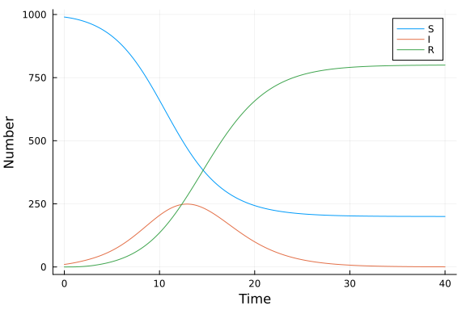

# Ordinary differential equation model with an Erlang infectious period using the method of stages

## Introduction

## Libraries

```julia
using ModelingToolkit
using OrdinaryDiffEq
using Plots
```


## Transitions

In this example, we will use `K=4` stages for the infectious compartment. In `Symbolics.jl`/`ModelingToolkit.jl`, this is denoted as `(I(t))[1:K]`. Note the use of list comprehension to define equations for stages 2 through `K`, and the use of the splat operator, `...`, which results in a single array of equations.

```julia
K = 4
@parameters t β c δ
@variables S(t) (I(t))[1:K] R(t)
D = Differential(t)
ΣI = sum(I[1:K])
N=S+ΣI+R
eqs = [D(S) ~ -β*c*ΣI/N*S,
       D(I[1]) ~ β*c*ΣI/N*S-δ*I[1],
       [D(I[i]) ~ δ*I[i-1] - δ*I[i] for i in 2:K]...,
       D(R) ~ δ*I[K]];
@named sys = ODESystem(eqs);
```


## Time domain

```julia
δt = 0.1
tmax = 40.0
tspan = (0.0,tmax);
```


## Initial conditions

We begin the simulation with all the initial infected individuals in the `I[1]` compartment.

```julia
u0 = [S => 990.0,
      I[1] => 10.0,
      [I[i] => 0.0 for i in 2:K]...,
      R => 0.0];
```


## Parameter values

To fix the mean duration of infectiousness, regardless of the number of stages, we divide the recovery rate, `γ`, by `K`.

```julia
p = [β=>0.05,
    c=>10.0,
    δ=>0.25*K];
```


## Running the model

```julia
prob_ode = ODEProblem(sys,u0,tspan,p;jac=true)
sol_ode = solve(prob_ode, Tsit5(), saveat=δt);
```


## Post-processing

```julia
out = Array(sol_ode)
Isum = vec(sum(out[2:(K+1),:],dims=1));
```


## Plotting the model

```julia
plot(sol_ode.t, out[1,:], xlabel="Time", ylabel="Number", label="S")
plot!(sol_ode.t, Isum, label="I")
plot!(sol_ode.t, out[end,:], label="R")
```


