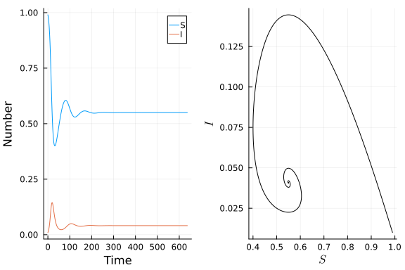

# Steady state solution of an ordinary differential equation model
Simon Frost (@sdwfrost), 2023-02-11

## Introduction

In this notebook, we find the steady state of an SIR model with births and deaths using several different approaches.

## Libraries

```julia
using ModelingToolkit
using OrdinaryDiffEq
using DifferentialEquations
using DiffEqCallbacks
using NonlinearSolve
using Random
using Distributions
using Plots
using LaTeXStrings
using DataFrames;
```


## Transitions

The model considered here is an extension of the standard SIR model to include an open population with births and deaths (the latter at per-capita rate `μ`). The variables `S` and `I` capture the proportion of individuals who are susceptible and infected, respectively, with the total population size fixed at 1 (and hence recovered individuals are present at proportion `1-S-I`).

```julia
@parameters t β γ μ
@variables S(t) I(t)
D = Differential(t)
eqs = [D(S) ~ μ - β*S*I - μ*S,
       D(I) ~ β*S*I - (γ+μ)*I];
```


This has two steady states; an unstable (disease free) steady state at `S=1.0, I=0` and a stable (endemic) steady state.

## Initial conditions and parameter values

```julia
u₀ = [S => 0.99, I => 0.01]
p = [β => 0.5, γ => 0.25, μ => 0.025];
```


## Analytical equilibrium

This model has analytical solutions for the steady state obtained by setting the derivatives to zero and solving for `S` and `I` (see [here](https://en.wikipedia.org/wiki/Compartmental_models_in_epidemiology)). Here, we use `substitute` from `SymbolicUtils.jl` to compute the endemic steady state, `(S₁, I₁)`.

```julia
R₀ = β/(γ + μ)
substitute(R₀, p)
```

```
1.8181818181818181
```


```julia
S₀ = 1/R₀
S₁ = substitute(S₀, p)
I₀ = (μ/β)*(R₀ - 1)
I₁ = substitute(I₀, p)
S₁, I₁
```

```
(0.55, 0.04090909090909091)
```


### Using ODEProblem and the TerminateSteadyState callback

We can run the ODE to (approximate) steady state by using a `TerminateSteadyState` callback from the `DiffEqCallbacks.jl` package.

```julia
@named sys = ODESystem(eqs)
odeprob = ODEProblem(sys, u₀, (0, 50000), p)
odesol = solve(odeprob, RK4(); abstol = 1e-13, callback = TerminateSteadyState(1e-8, 1e-6));
```


The code below plots a time series and a phase plot of `S(t)` and `I(t)`.

```julia
times = odesol.t[1]:0.1:odesol.t[end]
odeout = Array(odesol(times))'
l = @layout [a b]
p1 = plot(times,
          odeout[:, 1],
          xlabel="Time",
          ylabel="Number",
          label="S")
plot!(p1,
      times,
      odeout[:, 2],
      label="I")
p2 = plot(odeout[:,1],
     odeout[:,2],
     xlabel=L"S",
     ylabel=L"I",
     legend=false,
     color=:black)
plot(p1, p2, layout=l)
```




### Using SteadyStateProblem

Another way to implement the above is to define a  `SteadyStateProblem` and wrapping an ODE solver with `DynamicSS`.

```julia
ssprob = SteadyStateProblem(sys, u₀, p)
sssol = solve(ssprob, DynamicSS(RK4()); abstol=1e-13);
```


## Using NonlinearProblem

Another approach is to define a `NonlinearProblem` and solve using a nonlinear solver such as `NewtonRaphson`. A `NonlinearProblem` can be converted from a `SteadyStateProblem` or an `ODEProblem`.

```julia
nlprob = NonlinearProblem(odeprob)
nlsol = solve(nlprob, NewtonRaphson())
```

```
u: 2-element Vector{Float64}:
  1.0000243309002432
 -2.2119000221191253e-6
```


This approach fails to find the endemic equilibrium for the initial conditions `S₀=0.99, I₀=0.01`. This problem can be overcome by multiple runs with different initial conditions. Here, we generate random initial conditions by sampling from a `Dirichlet` distribution with dimension 3, and taking the first two numbers.

```julia
Random.seed!(1234)
ninits = 4
results = [[nlprob.u0; nlsol]]
for i in 1:ninits
    newu₀ = rand(Dirichlet(3,1))[1:2]
    prob = remake(nlprob, u0=newu₀)
    sol = solve(prob, NewtonRaphson())
    push!(results, [newu₀; sol])
end
df = DataFrame(mapreduce(permutedims, vcat, results), :auto)
rename!(df, [:S₀, :I₀, :S₁, :I₁])
df
```

```
5×4 DataFrame
 Row │ S₀         I₀         S₁        I₁
     │ Float64    Float64    Float64   Float64
─────┼────────────────────────────────────────────
   1 │ 0.99       0.01       1.00002   -2.2119e-6
   2 │ 0.325233   0.496458   0.549966   0.0409122
   3 │ 0.431837   0.380026   0.549999   0.0409091
   4 │ 0.78766    0.0944824  0.55       0.0409091
   5 │ 0.0975539  0.546526   0.549998   0.0409093
```


The random starts result in the endemic equilibrium being found.