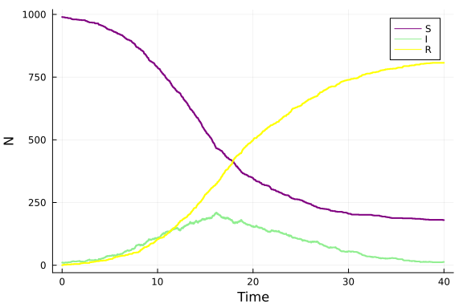

# Transmission network individual-level model (TN-ILM) using Pathogen.jl
Simon Frost (@sdwfrost), 2023-02-01

## Introduction

[Pathogen.jl](https://github.com/jangevaare/Pathogen.jl), described in [this paper](https://arxiv.org/abs/2002.05850), is a package to simulate transmission network individual-level models, in which individuals can have their own risk factors that affect their contact with others, their susceptibility, their infectivity on infection, their recovery rates, etc.. It includes methods for stochastic simulation and Bayesian inference of SEIR, SEI, SIR, and SI individual level models. This tutorial is based on that included in the Pathogen.jl package, available [here](https://github.com/jangevaare/Pathogen.jl/blob/master/examples/SIR%20Simulation/SIR%20TN-ILM%20Simulation%20and%20Inference.ipynb), but simplified to match the parameter values used in this repository as closely as possible, in order to generate comparable results.

## Libraries

```julia
using Random
using Distributions
using Pathogen
using Plots
using Plots.PlotMeasures
using BenchmarkTools;
```


We set the random number seed for reproducibility.

```julia
Random.seed!(1234);
```


## Setting up the population structure

We first set the population size, which is assumed to be fixed.

```julia
N = 1000;
```


Each individual in the population is assumed to be embedded in a landscape, that may reflect actual space, or some kind of risk space. As we assume that all individuals are identical in terms of risk, this information is just used to store `x` and `y` coordinates for plotting purposes.

```julia
locations = DataFrame(x = rand(Uniform(0, 10), N),
                      y = rand(Uniform(0, 10), N));
```


Pathogen.jl also assumes that a distance measure between individuals that can be used to parameterize the probability of infection. As we assume that all individuals are identical, this is set to be 1 between all pairs of individuals.

```julia
dists = [1.0 for i = 1:N, j = 1:N]
# Set diagonal to zero
[dists[i,i] = 0.0 for i in 1:N]
pop = Population(locations, dists);
```


## Setting up the population risks

We next define a series of utility functions that are used to define the risks for each individual.

```julia
function _constant(params::Vector{Float64}, pop::Population, i::Int64)
    return params[1]
end

function _one(params::Vector{Float64}, pop::Population, i::Int64)
    return 1.0
end

function _one(params::Vector{Float64}, pop::Population, i::Int64, k:: Int64)
    return 1.0
end

function _zero(params::Vector{Float64}, pop::Population, i::Int64)
    return 0.0
end;
```


`SIR` is a type defined within the Pathogen.jl package. Defining `RiskFunctions` for this type involves passing functions for 'sparks' (basically the rate of infection from outside the population), susceptibility, infectivity, transmissibility, and removal/recovery.

```julia
rf = RiskFunctions{SIR}(_zero, # sparks function
                        _one, # susceptibility function
                        _one, # infectivity function: defines a distance
                        _constant, # transmissability function
                        _constant); # removal function
```


A separate structure is used to define the parameters for the above functions. Empty arrays can be passed when the output is fixed. The transmissibility parameter is equivalent to `βc/N` in other examples in the repository.

```julia
rparams = RiskParameters{SIR}(Float64[], # sparks function parameter(s)
                              Float64[], # susceptibility function parameter(s)
                              Float64[], # infectivity function parameter(s)
                              [0.5/N], # transmissibility function parameter(s)
                              [0.25]); # removal function parameter(s)
```


## Initial conditions

Pathogen.jl defines states, such as `State_S`, `State_E`, `State_I`, and `State_R`, which are used to define the initial states of the system.

```julia
I₀ = 10
starting_states = [fill(State_I, I₀); fill(State_S, N-I₀)];
```


## Running the model

Initializing the simulation requires the population, the initial conditions, the risk functions, and the risk parameters.

```julia
sim = Simulation(pop, starting_states, rf, rparams);
```


The following call to `simulate!` changes the simulation in-place until a maximum time, `tmax`.

```julia
simulate!(sim, tmax=40.0);
```


## Plotting

Pathogen.jl has a convenience function for plotting the states of the models.

```julia
plot(sim.events, 0.0, 40.0)
```




## Benchmarking

```julia
@benchmark begin
sim = Simulation(pop, starting_states, rf, rparams)
simulate!(sim, tmax=40.0)
end
```

```
BenchmarkTools.Trial: 8 samples with 1 evaluation.
 Range (min … max):  630.645 ms … 675.947 ms  ┊ GC (min … max): 26.37% … 25
.67%
 Time  (median):     648.670 ms               ┊ GC (median):    26.24%
 Time  (mean ± σ):   650.774 ms ±  13.086 ms  ┊ GC (mean ± σ):  26.01% ±  0
.81%

  █                █ ██      █     █ █                        █  
  █▁▁▁▁▁▁▁▁▁▁▁▁▁▁▁▁█▁██▁▁▁▁▁▁█▁▁▁▁▁█▁█▁▁▁▁▁▁▁▁▁▁▁▁▁▁▁▁▁▁▁▁▁▁▁▁█ ▁
  631 ms           Histogram: frequency by time          676 ms <

 Memory estimate: 2.93 GiB, allocs estimate: 2485371.
```


